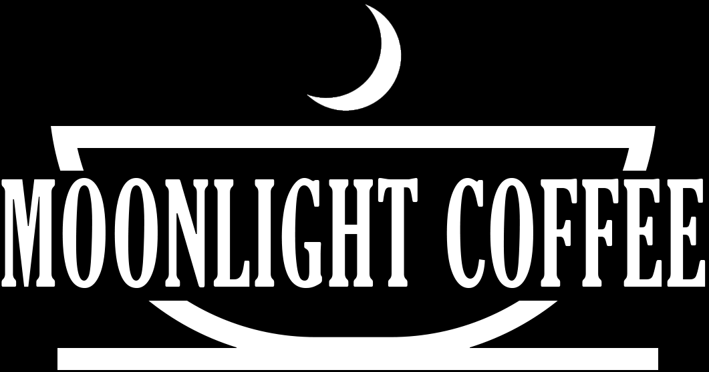

## MoonLight Coffee

Moonlight Coffee is a landing website for a fictional local coffee shop based in Orlando, FL. The website provides the user with classic restaurant elements in a Single Page Application (SPA) format using Vue Router to achieve this.



## Technologies Used

- JavaScript
- Vue.js
- TailwindCSS
- Firebase
- Anime.js

## Overview

Moonlight Coffee is designed to deliver the experience of visiting a local coffee shop in a digital format. The website contains all the elements you would expect in a restaurant website, including a menu, location information, and an about us section.

The site was built with Vue.js, using Vue Router to manage the routing for the SPA layout. The website also features smooth transitions between routes, implemented with the help of Anime.js.

The layout and styles were created using TailwindCSS, a utility-first CSS framework that provides a great deal of flexibility and control over the design.

The website is hosted and deployed using Firebase, allowing for a fast and reliable user experience.

## Development

To work on the project locally, you can clone the repository and install the dependencies:

## Project setup
```
npm install
```

### Compiles and hot-reloads for development
```
npm run serve
```

### Compiles and minifies for production
```
npm run build
```

### Lints and fixes files
```
npm run lint
```

### Customize configuration
See [Configuration Reference](https://cli.vuejs.org/config/).
